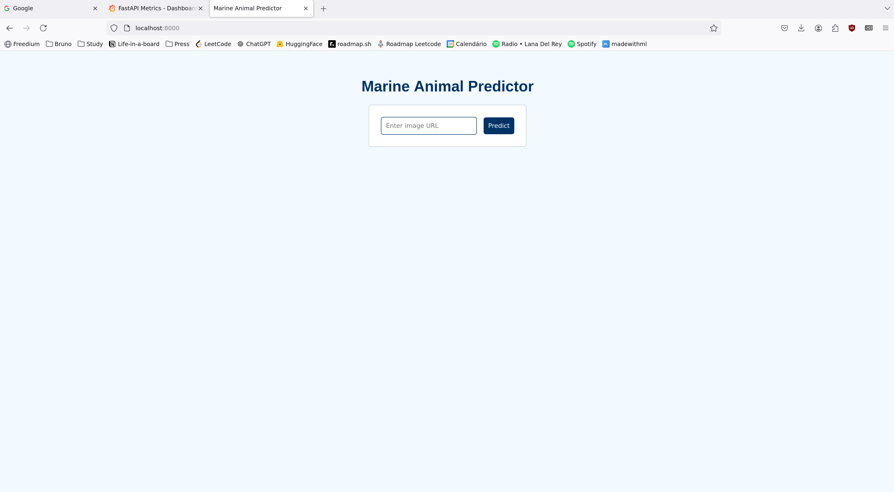
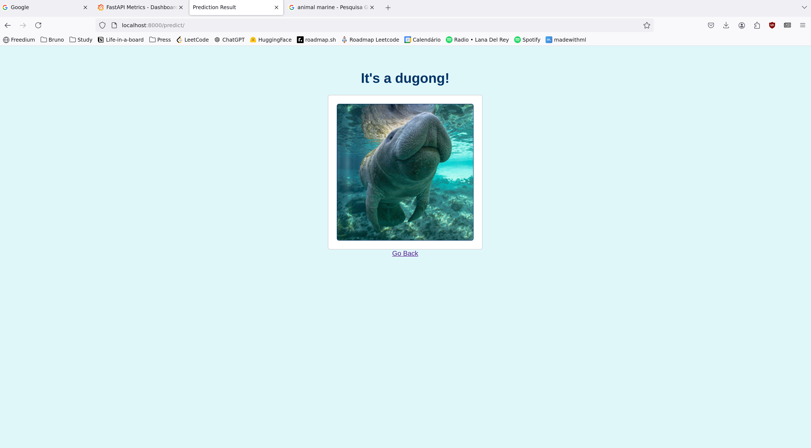
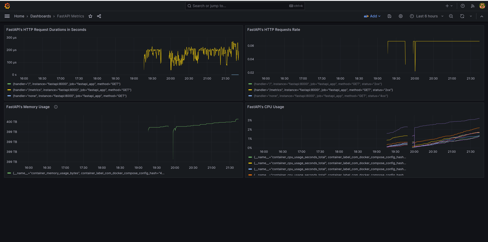
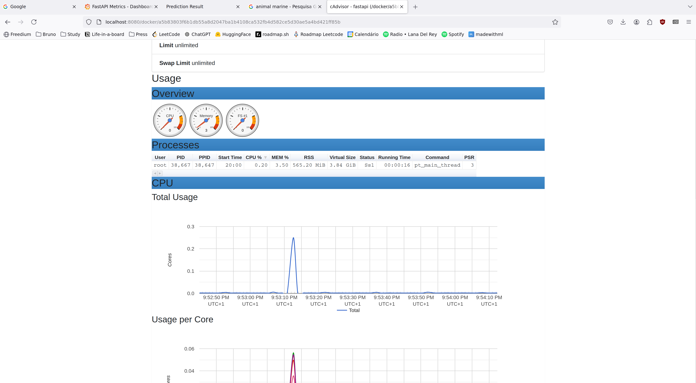

# OI.AI.MLEng.TakeHome: Marine Animal Predictor!

## Environment setup

#### libbz2-dev required on Ubuntu
If running Ubuntu, make sure that the following libraries are installed before installing Python through pyenv. By having it,
Python will be compiled considering these libraries:

`sudo apt install libbz2-dev`

#### Setup

1. Install [PyEnv](https://github.com/pyenv/pyenv)
1. Install [Poetry](https://python-poetry.org/)
1. Install [Docker](https://docs.docker.com/engine/install/)
1. Install Python 3.10.14 through pyenv: `pyenv install 3.10.14`
1. Move, or copy, git hooks to the correct folder: `cp .githooks/pre-commit .git/hooks/; chmod +x .git/hooks/pre-commit`
1. Run `poetry install`
1. Run `poetry run inv service`

*Note*: You may want set `poetry config virtualenvs.in-project true` to expect the virtual environment folder named `.venv` within the root directory of the project.

## Usage 
Access the endpoint `http://localhost:8000/` in your browser, and enter the URL of a picture of your choice. The service will tell you what animal is in the picture! :)

## Service Endpoints

1. Website (in FastAPI): `http://localhost:8000/`
1. Prometheus (Monitoring System): `http://localhost:9090/`
1. Grafana (Monitoring Dashboards): `http://localhost:3000/` (credentials: (username: `admin`, password: `admin`))
1. Cadvisor (Docker Performance): `http://localhost:8080/`

## Some Screenshots

1. Website front page

2. Website predictor page

3. Grafana Dashboards

4. Cadvisor of FastAPI's Docker container

